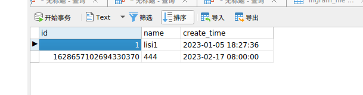

# SpringBoot 多数据源切换（超级简单）

### 背景：主从架构下，数据库的读写分离

##### 1. 依赖

    <dependencies>
		<dependency>
			<groupId>org.springframework.boot</groupId>
			<artifactId>spring-boot-starter-web</artifactId>
		</dependency>

		<dependency>
			<groupId>com.mysql</groupId>
			<artifactId>mysql-connector-j</artifactId>
			<scope>runtime</scope>
		</dependency>
		<dependency>
			<groupId>org.projectlombok</groupId>
			<artifactId>lombok</artifactId>
			<optional>true</optional>
		</dependency>
		<dependency>
			<groupId>org.springframework.boot</groupId>
			<artifactId>spring-boot-starter-test</artifactId>
			<scope>test</scope>
		</dependency>
		<dependency>
			<groupId>com.baomidou</groupId>
			<artifactId>mybatis-plus-boot-starter</artifactId>
			<version>3.5.3</version>
		</dependency>
        <!--引入baomidou的切换数据源的依赖-->
		<dependency>
			<groupId>com.baomidou</groupId>
			<artifactId>dynamic-datasource-spring-boot-starter</artifactId>
			<version>3.6.1</version>
		</dependency>
	</dependencies>

##### 2.配置数据源

```java
spring:
  datasource:
    dynamic:
      primary: master
      strict: true
      datasource:
        master:
          url: jdbc:mysql://127.0.0.1:3307/user1?useUnicode=true&characterEncoding=utf8&useSSL=false
          username: root
          password: root
          driver-class-name: com.mysql.cj.jdbc.Driver
        slave_1:
          url: jdbc:mysql://127.0.0.1:3308/user1?useUnicode=true&characterEncoding=utf8&useSSL=false
          username: root
          password: root
          driver-class-name: com.mysql.cj.jdbc.Driver
```

##### 3. 使用 （使用 @DS 切换数据源。）
```java
@DS 可以注解在方法上或类上，同时存在就近原则 方法上注解 优先于 类上注解。
```
| 注解 | 结果 |
|  ----  | ----  |
| 没有@DS | 默认数据源 |
| @DS("dsName") | dsName可以为组名也可以为具体某个库的名称 |

##### 4.例 ：用在serviceimpl上
```java

    @Override
    @DS("slave_1")
    public List<User> query() {
        return userDao.selectList(null);
    }

    /**
     * 新增数据
     *
     * @param user 实例对象
     * @return 实例对象
     */
    @Override
    @DS("master")
    public User insert(User user) {
        this.userDao.insert(user);
        return user;
    }
```


##### 为了区分数据不一样，两个数据库未做主从同步

> master的数据
> 


> slave_1的数据
> 


##### 5.用postman进行测试

> 获取数据，可以看到是slave_1的数据
> 


> 添加数据，可以看到添加到master中了
> 


### 完成～～～

